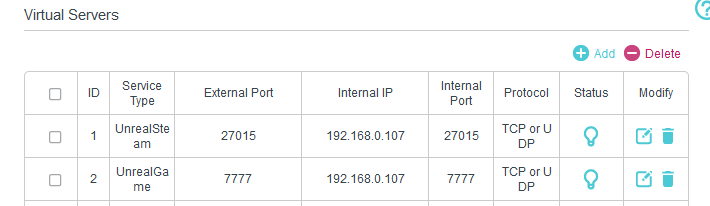
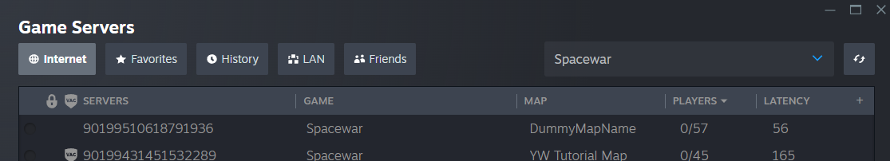

# WIP, not ready for public consumption yet

# Unreal Dedicated Servers with Steam sample application

## Requirements

- Ability to compile the engine
- Two Windows PCs
- Two Steam accounts

This sample demonstrates how to get dedicated servers working with Steam on UE 5.3.

This sample uses the popular Advanced Sessions plugin for creating and joining sessions, since it is a popular plugin for indie devs, but it is not a requirement for dedicated servers.

## Important: Firewall

The PC hosting the server MUST have its ports open. UDP port 27015 is used with the Steam master server, and port 7777 is used to actually connect to the game server.

How this is configured depends on your networking and router setup. Also make sure your software firewall (Windows Defender etc.) is configured to allow incoming traffic on those ports.



## Downloading the engine

Using dedicated servers with Steam WILL require a custom Engine build. This is due to some preprocessor defines (UE_PROJECT_STEAMPRODUCTNAME etc.) that cannot be changed without a full engine rebuild.
In addition, it is highly useful for servers to enable logging (UE_LOG etc) in Shipping builds, and this also requires a custom build.

```basic summary for updating the engine here```

## Building the Client application

Let's take a look at DediServerSample.Target.cs. This target will build the game client.

```
public DediServerSampleTarget(TargetInfo Target) : base(Target)
{
    Type = TargetType.Game;
    DefaultBuildSettings = BuildSettingsVersion.V4;
    IncludeOrderVersion = EngineIncludeOrderVersion.Unreal5_3;
    DediServerSampleTarget.ApplySharedTargetSettings(this);
    ExtraModuleNames.Add("DediServerSample");
    DisablePlugins.Add("OpenImageDenoise");
}

internal static void ApplySharedTargetSettings(TargetRules Target)
{
    Target.bUseLoggingInShipping = true;
    Target.GlobalDefinitions.Add("UE_PROJECT_STEAMSHIPPINGID=480");
    Target.GlobalDefinitions.Add("UE_PROJECT_STEAMPRODUCTNAME=\"spacewar\"");
    Target.GlobalDefinitions.Add("UE_PROJECT_STEAMGAMEDIR=\"spacewar\"");
    Target.GlobalDefinitions.Add("UE_PROJECT_STEAMGAMEDESC=\"Spacewar\"");
}
```

The four UE_PROJECT_... definitions need to be changed for your own application. This sample uses Valve's 'spacewar' test application ID, which is a common way of developing Steam games with Unreal before acquiring your proper application ID.

Note if you don't want to use the 'logging in shipping' flag, feel free to remove it, it is not required for this sample to work.

There's a 'one-click' build script included in this repository, in Tools/Build/build_development_client.cmd. It looks like this:

```
@echo "Building Development"
@set PROJECT=%~dp0../../DediServerSample.uproject
@set ENGINEPATH=D:/git/UnrealEngine-Angelscript
@set OUTPUT=%~dp0../Steam/content
"%ENGINEPATH%/Engine/Build/BatchFiles/RunUAT" BuildCookRun^
 -project="%PROJECT%"^
 -targetplatform=Win64^
 -noserver^
 -clientconfig=Development^
 -serverconfig=Development^
 -build^
 -cook^
 -pak^
 -stage^
 -nop4^
 -utf8output^
 -stagingdirectory="%OUTPUT%"
@pause
```

Change the ENGINEPATH to point to your actual engine location (no trailing slash), and of course if you use this in your own project change the .uproject path as well.
Running this script will build the Engine, editor and game in Development configuration, cook the content and finally package it under Tools/Steam/Content/Windows (handy for later steam uploading).

## Building the Server application

DediServerSampleServer.Target.cs does not need to be modified, as it sets up the Steam defines with ```DediServerSampleTarget.ApplySharedTargetSettings(this);```.

```
public DediServerSampleServerTarget(TargetInfo Target) : base(Target)
{
    Type = TargetType.Server;
    DefaultBuildSettings = BuildSettingsVersion.V4;
    IncludeOrderVersion = EngineIncludeOrderVersion.Unreal5_3;
    DediServerSampleTarget.ApplySharedTargetSettings(this);
    ExtraModuleNames.Add("DediServerSample");
    DisablePlugins.Add("OpenImageDenoise");
}
```

## Verifying the Server is visible in Steam

In Steam, go to View->Game Servers and look for "Spacewar" servers. The sample application server will show up like this:



If it doesn't show up:
1. Check the server log that no errors or warnings occurred during server launch
2. Check your firewall setup.

## Troubleshooting: Testing without Steam

This can help to rule out firewall issues.

- Launch the server with -nosteam
- Launch the client with -nosteam
- In client, open console and type "open 127.0.0.1" (if the server is running on the same PC)

The client should successfully connect to the server. If it doesn't, check your firewall setup.

## Bonus: Uploading your game to Steam

Example Steam upload scripts (.vdf and .cmd files) are found under Tools/Steam/. First you should download Steamcmd.exe from https://steamcdn-a.akamaihd.net/client/installer/steamcmd.zip and place the .exe in Tools/Steam/Builder. Then you'll need to modify the .vdf files to use your own app IDs and file names, but once they're set up you should be able to deploy new builds to Steam simply by running the Build scripts and then the Upload .cmd.

## Bonus: Running a server on Steam Deck for testing

Explain how to launch a serer on the Deck

## License

This sample is licensed under MIT.

```
Permission is hereby granted, free of charge, to any person obtaining a copy of this software and associated documentation files (the “Software”), to deal in the Software without restriction, including without limitation the rights to use, copy, modify, merge, publish, distribute, sublicense, and/or sell copies of the Software, and to permit persons to whom the Software is furnished to do so, subject to the following conditions:

The above copyright notice and this permission notice shall be included in all copies or substantial portions of the Software.

THE SOFTWARE IS PROVIDED “AS IS”, WITHOUT WARRANTY OF ANY KIND, EXPRESS OR IMPLIED, INCLUDING BUT NOT LIMITED TO THE WARRANTIES OF MERCHANTABILITY, FITNESS FOR A PARTICULAR PURPOSE AND NONINFRINGEMENT. IN NO EVENT SHALL THE AUTHORS OR COPYRIGHT HOLDERS BE LIABLE FOR ANY CLAIM, DAMAGES OR OTHER LIABILITY, WHETHER IN AN ACTION OF CONTRACT, TORT OR OTHERWISE, ARISING FROM, OUT OF OR IN CONNECTION WITH THE SOFTWARE OR THE USE OR OTHER DEALINGS IN THE SOFTWARE.
```